RESTful API for the Android client to use for the app named "Mission Pangpang." Developed with node.js

# What is Mission PangPang?

The app is intended to teach young kids discipline to do things that they usually would not want to do by providing rewards if they complete a mission given by the parent.

# Features

There are two modes in the app. Parent mode and Child mode.

## Parent mode

1. Parents set the **mission** and **reward**.
    
   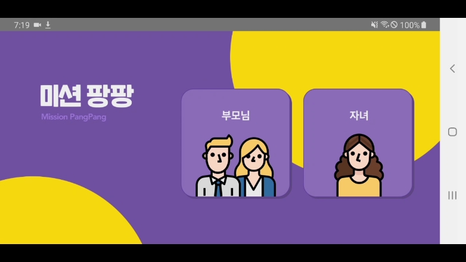

2. Set the mission's title.The mission consists of a **time limit**, and a **number of repetitions** for a certain task.
    
   
    
   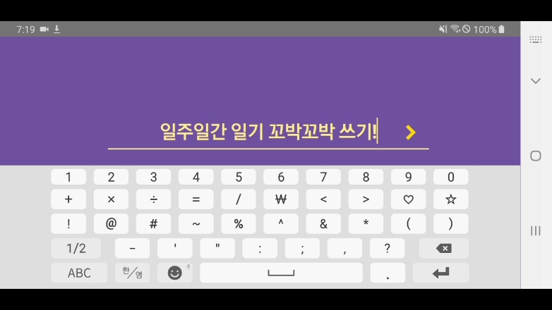

3. Set the **reward**.
    
   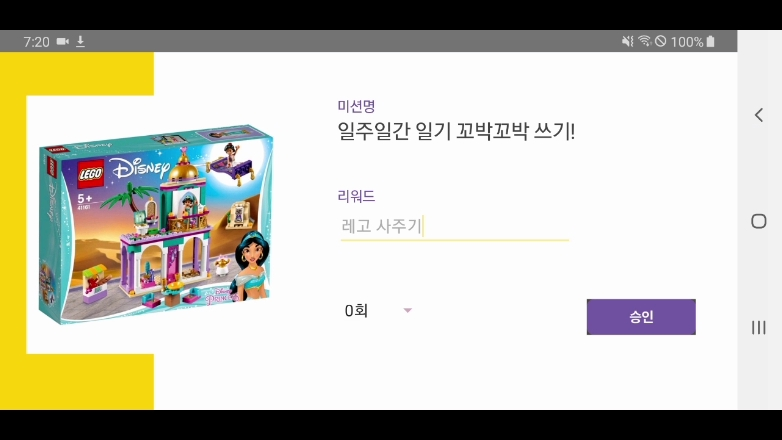
4. Set the target **number** of repetitions.
    
   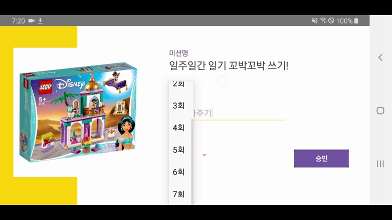

5. **Send** the mission to the child.
    
   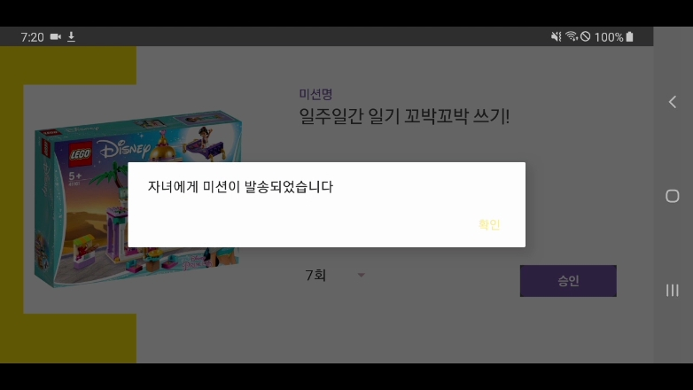

6. When the child sends a confimation request after completing a task, **confirm or deny** the request.
    
   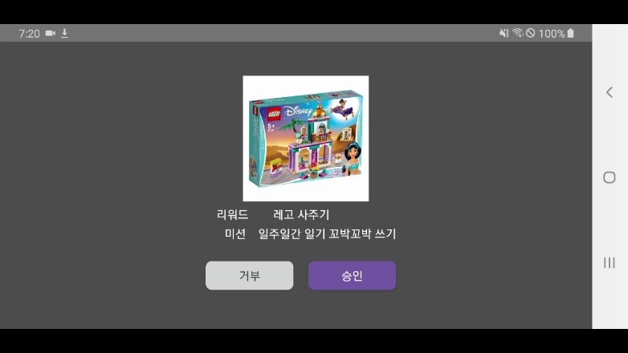

## Child mode

1. View the **progresison** of the current mission
    
   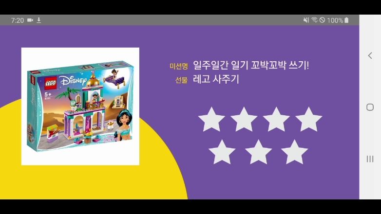

2. Choose a **photo** to send in the confirmation request.
    
   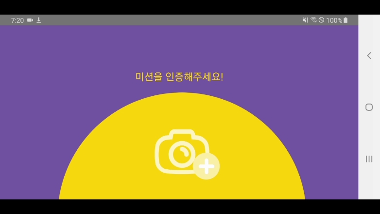

3. **Send** a confirmation request.
    
   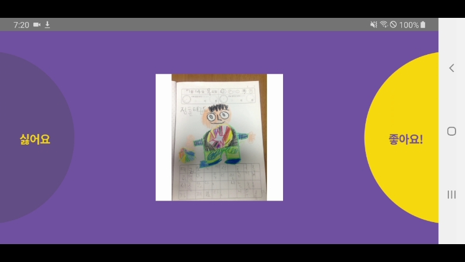

4. When the parent confirms it, a **star is earned**.
    
   

5. When all stars are filled and the **mission is complete**, **reward** is earned.
    
   

# API

 
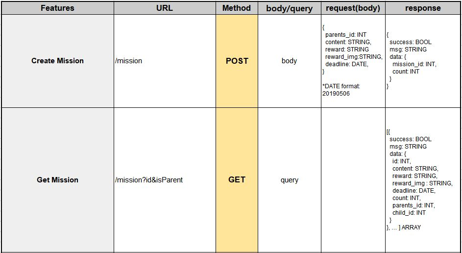
 
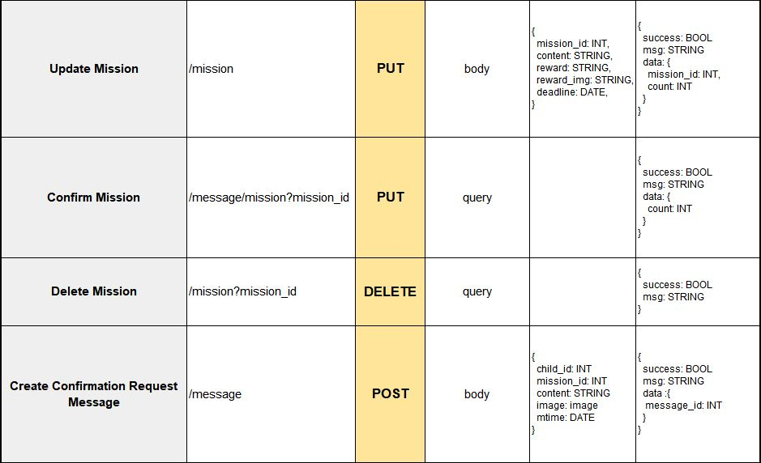
 
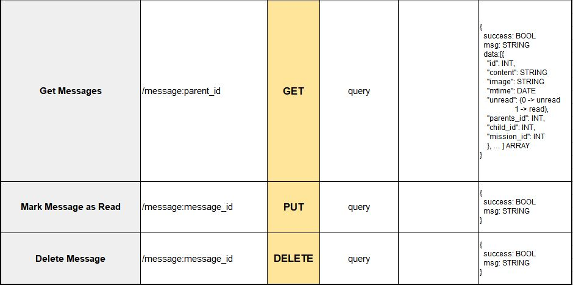
